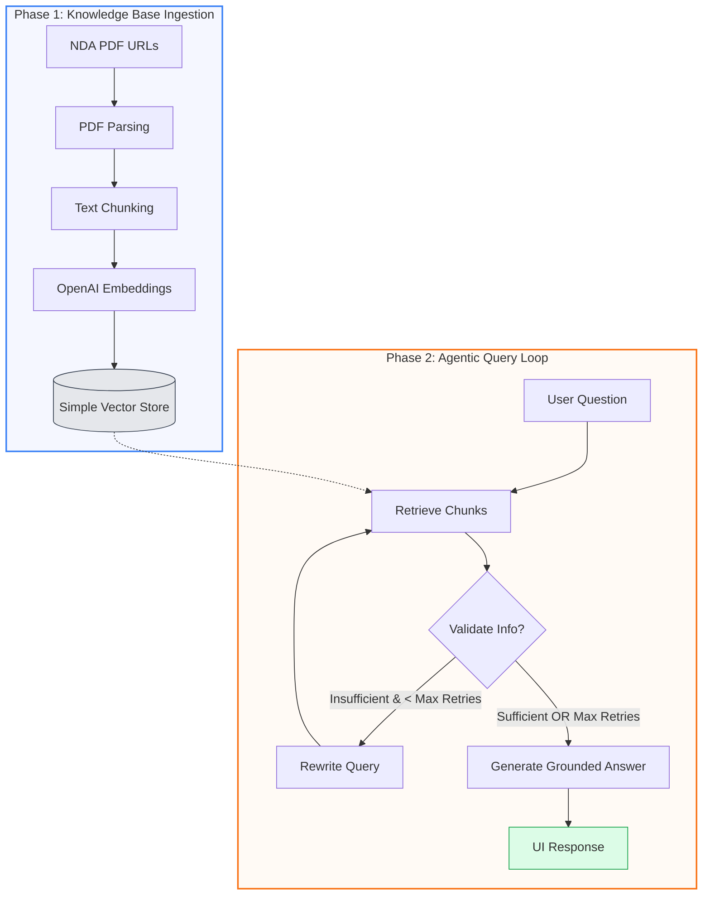

# Overall Process Map: Agentic PDF RAG

The following diagram illustrates the end-to-end flow of the system, divided into two primary phases: **Ingestion** (data preparation) and **Reasoning** (the agentic search loop).

---

## Phase 1: Ingestion (Backend)
This phase happens once (or when triggered) to prepare the data.
1.  **PDF Parsing**: The system fetches PDFs from URLs and converts them to raw text.
2.  **Chunking**: Text is broken into paragraphs to maintain semantic meaning.
3.  **Embedding**: Each chunk is sent to OpenAI to generate a 1536-dimensional vector.
4.  **Storage**: Vectors and text are stored in the local `SimpleVectorStore`.

## Phase 2: Reasoning (Agentic Loop)
This phase happens every time a user asks a question.
1.  **Retrieve**: The agent pulls the top 8 most similar chunks from the store.
2.  **Validate**: A "Judge" LLM reviews the chunks to see if they actually answer the specific question.
3.  **Rewrite**: If the judge finds the info lacking, it identifies the "missing piece" and rewrites the query to find it.
4.  **Generate**: Once the agent is satisfied (or gives up), it synthesizes the final answer using only the verified evidence.
5.  **UI Response**: The final answer is displayed along with a "Correction Trace" showing the agent's internal thought process.
